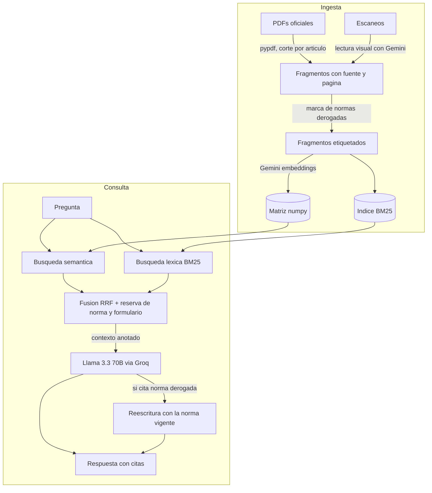

# NormaObra 🇨🇱

Asistente de preguntas y respuestas en lenguaje natural sobre la normativa chilena de urbanismo y construcción, construido con RAG (Retrieval-Augmented Generation). Cada respuesta cita el documento y las páginas exactas de donde proviene, para que siempre puedas verificar contra la fuente oficial.

> ¿Necesito permiso para ampliar mi casa? ¿Qué documentos exige una recepción definitiva? ¿Puedo cerrar la terraza de mi departamento? — pregunta como le preguntarías a un profesional.

<!-- TODO: captura de pantalla de la interfaz -->

## Corpus

**8.021 fragmentos** de 315 documentos, agrupados por rango normativo — porque una circular del MINVU y un manual ilustrado no tienen la misma fuerza que una ley.

| | Documento | Versión | Fragmentos |
|---|---|---|---|
| **Normativa vigente** | LGUC — Ley General de Urbanismo y Construcciones (DFL 458) | 24-06-2026 | 355 |
| | OGUC — Ordenanza General de Urbanismo y Construcciones (DS 47) | 16-03-2026 | 1.102 |
| | Ley N° 21.442 — Copropiedad Inmobiliaria | 16-02-2026 | 166 |
| | Reglamento de la Ley N° 21.442 | 09-01-2025 | 69 |
| | Ley N° 21.807 — Planificación territorial | 16-02-2026 | 75 |
| | DS 50 — Accesibilidad Universal | 04-03-2016 | 54 |
| **Interpretación oficial** | 250 Circulares DDU generales vigentes, hasta la DDU 548 | — | 5.159 |
| **Procedimiento** | 57 Formularios Únicos Nacionales de edificación | — | 459 |
| **Material explicativo** | OGUC Ilustrada, tomos I y II | — | 582 |

Los fragmentos se cortan respetando los límites de "Artículo N°" para no partir normas por la mitad. De las 250 circulares, 42 son escaneos antiguos sin capa de texto y no participan en la búsqueda.

## Cómo funciona



Decisiones de diseño orientadas a costo, confiabilidad y simplicidad:

- **Base vectorial en numpy puro** — para un corpus de este tamaño, la similitud coseno sobre una matriz en memoria responde en milisegundos, sin servicios externos ni dependencias nativas (funciona hasta en Windows ARM64).
- **Recuperación híbrida** — BM25 encuentra coincidencias exactas ("artículo 4.2.7", "DDU 514"), los embeddings entienden paráfrasis. Los dos rankings se fusionan con Reciprocal Rank Fusion, que combina *posiciones* y no puntajes: la similitud coseno y el puntaje BM25 no comparten escala. Si la vía semántica falla, la búsqueda continúa solo con BM25 en vez de caer.
- **Reserva de fuentes** — RRF premia aparecer en ambos rankings, así que una ley fuerte en una sola vía perdía contra circulares peor posicionadas en las dos. Se reserva un lugar para la norma vigente y otro para el formulario aplicable, con umbrales medidos sobre el corpus real. Se reemplaza, nunca se agrega: el contexto no crece.
- **Ingesta incremental idempotente** — los fragmentos se identifican por hash de su texto, así reindexar solo paga los nuevos. Reordenar el corpus o corregir una regla de citación cuesta cero.
- **LLM vía Groq con respaldo en Gemini** — Llama 3.3 70B responde rápido y gratis, pero su tier libre tope en 12.000 tokens/minuto; al saturarse, Gemini Flash Lite toma el relevo automáticamente. Si ambos caen, se entregan los fragmentos recuperados en crudo antes que un error.
- **Prompt anti-alucinación** — el modelo responde solo desde el contexto recuperado y declara cuando la normativa no cubre la pregunta.

## Vigencia normativa

Una respuesta puede ser impecable y aun así estar equivocada, si el texto de origen dejó de regir. El problema más sutil no es tener documentos viejos, sino este:

> **Un documento vigente puede citar una norma derogada.** La Circular DDU 375 es de 2017, el MINVU la publica como vigente y su doctrina se aplica, pero habla de la Ley 19.537, derogada en 2022. Descartar el documento perdería doctrina aplicable; repetir su cita a ciegas produce una respuesta que un revisor descarta en el primer párrafo. La salida correcta es mapear.

El proyecto trata la vigencia como una capa propia:

- **`data/manifest.json`** registra cada fuente con su hash, fechas de publicación y versión, URL oficial y estado. `check_vigencia.py` audita que los archivos no hayan cambiado a espaldas del registro, que ninguna versión haya caducado, que las colecciones sigan sincronizadas con el índice del MINVU y que lo declarado esté realmente indexado. Termina con código distinto de cero si algo requiere acción.
- **`data/vigencia.json`** mapea normas derogadas a las que las reemplazaron, con concordancias artículo por artículo cuando están verificadas. Actúa en tres momentos: el prompt del sistema, la anotación del fragmento en el contexto y un chequeo de la respuesta que obliga a reescribir si el modelo repitió una cita derogada. Hoy hay **130 fragmentos en 51 fuentes** marcados por citar la Ley 19.537.

## Estructura

```
core/                    # lógica del RAG, un módulo por responsabilidad
├── config.py            #   configuración y rutas únicas
├── chunking.py          #   PDF → fragmentos con fuente, página y marcas
├── embeddings.py        #   cliente Gemini (único módulo que conoce el proveedor)
├── store.py             #   base vectorial (guardar / cargar / buscar)
├── bm25.py              #   índice léxico, Python puro
├── vision.py            #   lectura visual de escaneos
├── llm.py               #   prompt + Groq con respaldo en Gemini
├── vigencia.py          #   mapeo de normas derogadas
├── manifest.py          #   registro de fuentes
├── analytics.py         #   registro de uso (stdout + Upstash opcional)
└── rag.py               #   orquestación pregunta → respuesta
data/
├── 00_inbox/            #   documentos nuevos sin validar (fuera del corpus)
├── 01_sources/          #   fuentes oficiales, por tipo jurídico
├── 02_processed/        #   extracciones visuales
├── 90_archive/          #   versiones superadas (fuera del corpus)
├── manifest.json        #   qué es cada archivo y de qué versión
└── vigencia.json        #   qué norma reemplazó a cuál
ingest_incremental.py    # ingesta que solo paga lo nuevo
ingest_vision.py         # extracción de escaneos con Gemini
download_ddu.py          # descarga las circulares DDU vigentes
download_formularios.py  # descarga los Formularios Únicos Nacionales
check_vigencia.py        # auditoría de vigencia del corpus
build_bm25.py            # reconstruye el índice léxico
query.py                 # CLI de consultas
stats.py                 # reporte de uso (requiere Upstash)
app.py                   # API (FastAPI)
tests/                   # pytest, sin consumo de APIs
web/                     # frontend (Next.js 16 + Tailwind 4 + shadcn)
```

## Inicio rápido

Requisitos: Python 3.10+, Node 20+, y API keys de [Groq](https://console.groq.com) y [Google AI Studio](https://aistudio.google.com).

```bash
# 1. Backend
python -m venv venv
venv\Scripts\activate              # Windows  ·  source venv/bin/activate en Mac/Linux
pip install -r requirements.txt

# 2. Credenciales — crea .env en la raíz:
#    GROQ_API_KEY=...
#    GEMINI_API_KEY=...

# 3. Corpus
python download_ddu.py                    # circulares DDU desde el MINVU
python download_formularios.py            # Formularios Únicos Nacionales
python ingest_incremental.py --dry-run    # informe sin costo: qué falta vectorizar
python ingest_incremental.py              # vectoriza solo lo pendiente

# 4. Levantar la app (dos terminales)
uvicorn app:app --reload                  # API en :8000
cd web && npm install && npm run dev      # frontend en :3000
```

Abre **http://localhost:3000**.

```bash
python -m pytest tests/            # tests, sin llamar a ninguna API
python check_vigencia.py           # ¿sigue vigente lo que tenemos?
```

## Roadmap

- [x] RAG multi-documento con citas verificables
- [x] Interfaz web (Next.js + Tailwind + shadcn)
- [x] Despliegue público
- [x] Búsqueda híbrida (BM25 + embeddings con RRF)
- [x] Lectura visual de documentos escaneados
- [x] Analítica de uso (qué pregunta la gente, dónde falla el asistente)
- [x] Control de vigencia y mapeo de normas derogadas
- [ ] Lectura visual de las 42 circulares escaneadas que aún quedan fuera del índice
- [ ] Fecha de publicación por circular, hoy solo disponible a nivel de colección
- [ ] Planes reguladores comunales e intercomunales
- [ ] Listados técnicos DITEC (fuego, térmico, acústico)
- [ ] Dictámenes de Contraloría y circulares DDU específicas

## Aviso

Herramienta informativa no oficial, sin afiliación con el MINVU. Las respuestas son generadas por un modelo de lenguaje y pueden contener errores: verifica siempre contra el texto vigente de la normativa y consulta a un profesional competente antes de tomar decisiones.
