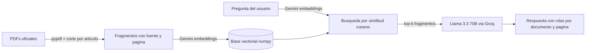

# Asistente Normativo de Urbanismo y Construcción 🇨🇱

Asistente de preguntas y respuestas en lenguaje natural sobre la normativa chilena de urbanismo y construcción, construido con RAG (Retrieval-Augmented Generation). Cada respuesta cita el documento y las páginas exactas de donde proviene, para que siempre puedas verificar contra la fuente oficial.

> ¿Necesito permiso para ampliar mi casa? ¿Qué exige el DS 50 para un acceso universal? ¿Qué circular DDU instruye la ley de autoconstrucción? — pregunta como le preguntarías a un profesional.

<!-- TODO: captura de pantalla de la interfaz -->

## Corpus normativo

| Documento | Fuente |
|---|---|
| OGUC — Ordenanza General de Urbanismo y Construcciones (marzo 2026) | MINVU |
| LGUC — Ley General de Urbanismo y Construcciones (septiembre 2025) | MINVU |
| Ley de Copropiedad Inmobiliaria N° 21.442 | MINVU |
| DS 50 — Accesibilidad Universal | MINVU |
| ~250 Circulares DDU generales vigentes | MINVU (descarga automatizada) |

**6.827 fragmentos** indexados, cortados respetando los límites de "Artículo N°" para no partir normas por la mitad.

## Cómo funciona



Decisiones de diseño orientadas a costo y simplicidad:

- **Base vectorial en numpy puro** — para un corpus de este tamaño, la similitud coseno sobre una matriz en memoria responde en milisegundos, sin servicios externos ni dependencias nativas (funciona hasta en Windows ARM64).
- **Embeddings por API** (Gemini) — el servidor no carga modelos; puede desplegarse en hosting mínimo.
- **LLM vía Groq con respaldo en Gemini** — Llama 3.3 70B responde rápido y gratis, pero su tier libre tope en 12.000 tokens/minuto; al saturarse, Gemini Flash toma el relevo automáticamente para que nadie vea un error por demanda.
- **Prompt anti-alucinación** — el modelo responde solo desde el contexto recuperado y declara cuando la normativa no cubre la pregunta.

## Estructura

```
core/               # lógica del RAG, un módulo por responsabilidad
├── config.py       #   configuración única
├── chunking.py     #   PDF → fragmentos con fuente y página
├── embeddings.py   #   cliente Gemini (único módulo que conoce el proveedor)
├── store.py        #   base vectorial (guardar / cargar / buscar)
├── llm.py          #   prompt + Groq con respaldo en Gemini
├── analytics.py    #   registro de uso (stdout + Upstash opcional)
└── rag.py          #   orquestación pregunta → respuesta
ingest.py           # ingesta del corpus (reanudable con checkpoints)
download_ddu.py     # descarga las circulares DDU vigentes desde el MINVU
query.py            # CLI de consultas
stats.py            # reporte de uso (requiere Upstash)
app.py              # API (FastAPI)
tests/              # pytest, sin consumo de APIs
web/                # frontend (Next.js 16 + Tailwind 4 + shadcn)
```

## Inicio rápido

Requisitos: Python 3.10+, Node 20+, y API keys gratuitas de [Groq](https://console.groq.com) y [Google AI Studio](https://aistudio.google.com).

```bash
# 1. Backend
python -m venv venv
venv\Scripts\activate              # Windows  ·  source venv/bin/activate en Mac/Linux
pip install -r requirements.txt

# 2. Credenciales — crea .env en la raíz:
#    GROQ_API_KEY=...
#    GEMINI_API_KEY=...

# 3. Corpus y base vectorial
python download_ddu.py             # descarga las circulares DDU (opcional)
python ingest.py                   # vectoriza todo data/ (reanudable)

# 4. Levantar la app (dos terminales)
uvicorn app:app --reload           # API en :8000
cd web && npm install && npm run dev   # frontend en :3000
```

Abre **http://localhost:3000**.

```bash
python -m pytest tests/            # correr los tests
```

## Roadmap

- [x] RAG multi-documento con citas verificables
- [x] Interfaz web (Next.js + Tailwind + shadcn)
- [ ] Despliegue público
- [ ] Analítica de uso (qué pregunta la gente, dónde falla el asistente)
- [ ] Búsqueda híbrida (BM25 + embeddings)
- [ ] OCR para circulares escaneadas antiguas

## Aviso

Herramienta informativa no oficial, sin afiliación con el MINVU. Las respuestas son generadas por un modelo de lenguaje y pueden contener errores: verifica siempre contra el texto vigente de la normativa y consulta a un profesional competente antes de tomar decisiones.
